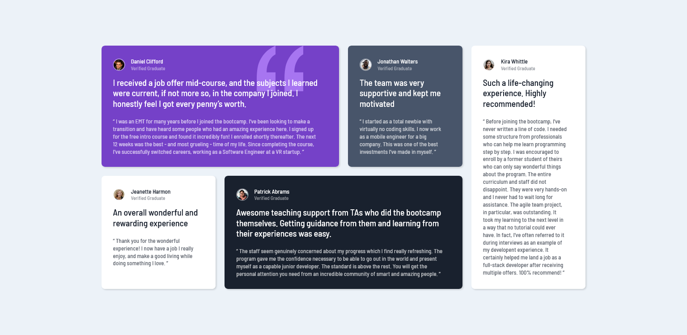

# Frontend Mentor - Social proof section solution

This is a solution to the [Testimonials grid section challenge on Frontend Mentor](https://www.frontendmentor.io/challenges/social-proof-section-6e0qTv_bA).

## Table of contents

- [Overview](#overview)
  - [The challenge](#the-challenge)
  - [Screenshot](#screenshot)
  - [Links](#links)
- [My process](#my-process)
  - [Built with](#built-with)
  - [What I learned](#what-i-learned)
  - [Continued development](#continued-development)
  - [Useful resources](#useful-resources)
- [Author](#author)

## Overview

### The challenge

Users should be able to:

- View the optimal layout for the section depending on their device's screen size

### Screenshots




### Links

- [Live Site](https://airdgo-testimonials-grid.netlify.app)

## My process

### Built with

- Semantic HTML5 markup
- CSS custom properties
- Flexbox
- CSS Grid

### What I learned

I've learned how to use grid for layouts.

```css
main {
    display: grid;
    justify-content: center;
    grid-template-columns: repeat(auto-fit, minmax(15rem, 1fr));
    grid-template-rows: repeat(2, auto);
    grid-gap: 20px;
    width: 70.5%;
    max-width: 70rem;
}
```

### Continued development

In future projects I want to expand my knowladge about grid layouts.

### Useful resources

- [Grid Tips and Tricks](https://css-tricks.com/snippets/css/complete-guide-grid/)

## Author

- Frontend Mentor - [@airdgo](https://www.frontendmentor.io/profile/airdgo)